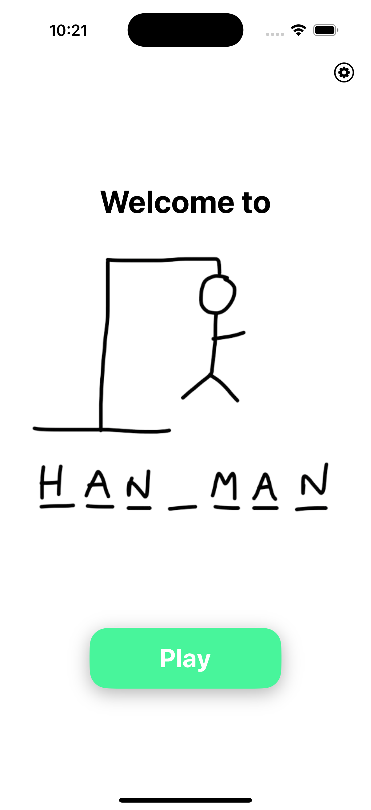

# Hangman

Ein einfaches Hangman-Spiel, entwickelt in Swift.

## Übersicht

Dieses Projekt ist eine Umsetzung des klassischen Hangman-Spiels, entwickelt in Zusammenarbeit mit [Tobias Pummer](https://github.com/TobiasPummer). Der Spieler muss ein verstecktes Wort erraten, indem er Buchstaben auswählt. Jeder falsche Buchstabe bringt den Spieler dem Verlust eines Lebens näher. Das Ziel ist es, das Wort zu erraten, bevor die Leben aufgebraucht sind.

## Features

- Benutzerfreundliche Oberfläche
- Fehleranzeige und Lebensverwaltung
- Verschiedene Schwierigkeitsgrade oder Wortlisten

## Verwendung

Starte das Spiel und beginne, Buchstaben zu raten. Das Spiel endet, wenn das Wort erraten wurde oder die Leben aufgebraucht sind.

## UI

